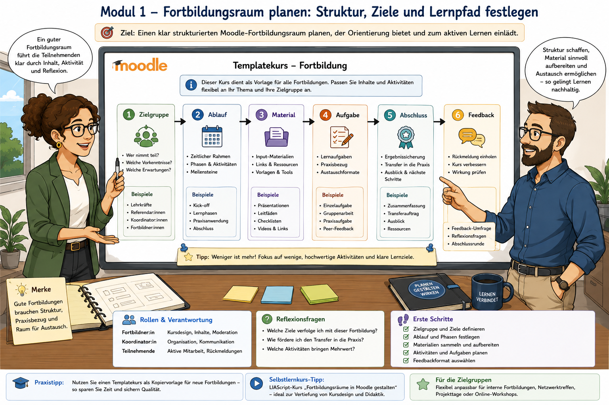
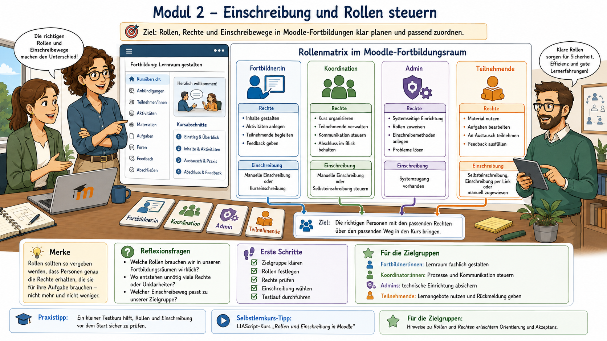
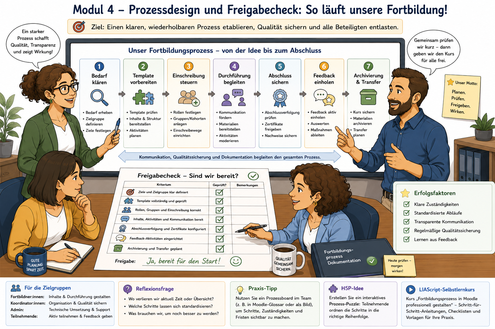

<!--
author: Stefan Hierholzer
email:
version: 1.0
language: de
narrator: German Male

comment: Selbstlernkurs Moodle als Fortbildungsplattform nutzen.
         Für Fort- und Weiterbildner:innen, Koordinator:innen, Schulleitungen und Moodle-Verantwortliche
         an Fachschulen für Sozialwesen, Berufsschulen und außerschulischen Bildungsorganisationen. DQR Niveau 6.

logo: moodle_fortbildungsplattform.png

import: https://raw.githubusercontent.com/LiaScript/docs/master/README.md

link: https://fonts.googleapis.com/css2?family=Source+Sans+Pro:wght@300;400;600&display=swap
-->

# Moodle als Fortbildungsplattform nutzen

> **Ein kompakter Selbstlernkurs für Fort- und Weiterbildner:innen sowie Koordinator:innen vor internen Fortbildungen**

---

## 📋 Kursübersicht

| Angabe | Information |
|--------|-------------|
| **Thema** | Moodle als Fortbildungsplattform nutzen |
| **Anknüpfungspunkt** | Vor internen Fortbildungen |
| **Zielgruppe** | Fort- und Weiterbildner:innen, Koordinator:innen |
| **Zeitaufwand** | ca. 45 Minuten |
| **Niveau** | DQR Stufe 6 |
| **Format** | Selbstlernkurs mit Raumplanungsaufgabe, Prozessdesign und Checkliste |
| **Benötigtes Material** | Templatekurs, Prozessbeschreibung, Zertifikatsmuster |

---

## 🎯 Kompetenzorientierte Lernziele (DQR 6)

Nach Abschluss dieses Kurses sind Sie in der Lage:

**Wissen und Verstehen**

1. Moodle-Fortbildungsräume als strukturierte Arbeits- und Nachweisräume zu erklären und von reinen Materialablagen abzugrenzen.
2. Einschreibung, Rollen, Abschlussverfolgung, Zertifikat und Feedback als zusammenhängende Prozessarchitektur zu beschreiben.
3. typische Risiken bei internen Fortbildungen zu erkennen: unklare Zielgruppe, offene Zugänge, fehlende Abschlusslogik, nicht auswertbares Feedback und nicht dokumentierte Teilnahme.

**Können – instrumentale und systemische Kompetenzen**

4. einen Fortbildungsraum auf Basis eines Templatekurses fachlich konsistent zu planen.
5. passende Einschreibeverfahren für unterschiedliche Fortbildungsformate begründet auszuwählen.
6. Abschlusskriterien, Feedback und Zertifikatsausgabe so zu kombinieren, dass Teilnahme, Bearbeitung und Rückmeldung nachvollziehbar werden.

**Können – kommunikative und soziale Kompetenzen**

7. Zuständigkeiten zwischen Fortbildner:innen, Koordination, Administration und Teilnehmenden transparent zu klären.
8. Fortbildungsprozesse so zu dokumentieren, dass sie wiederholbar, prüfbar und für weitere schulische Entwicklungsprozesse nutzbar sind.

---

## ⏱️ Zeitplanung

```ascii
Modul 0: Einstieg und Prozessblick                  5 min
Modul 1: Fortbildungsraum planen                   10 min
Modul 2: Einschreibung und Rollen steuern          10 min
Modul 3: Abschluss, Zertifikat und Feedback        12 min
Modul 4: Prozessdesign und Freigabecheck            8 min
────────────────────────────────────────────────────────
Gesamt:                                      ca. 45 min
```

---

## Modul 0: Einstieg – Fortbildung braucht mehr als einen Kursraum

### Ausgangspunkt

Interne Fortbildungen scheitern selten daran, dass Moodle technisch keinen Raum bereitstellt. Sie scheitern eher daran, dass der Raum nicht als Prozess gedacht wurde. Material ist hochgeladen, aber die Zielgruppe ist nicht sauber eingeschrieben. Eine Teilnahmebestätigung wird gebraucht, aber Abschlusskriterien fehlen. Feedback wird gewünscht, aber die Fragen sind nicht auswertbar. Oder ein Kurs wird nach der Fortbildung vergessen und bleibt als unklarer Altbestand im System liegen.

Moodle kann interne Fortbildungen wesentlich stabiler machen, wenn Fortbildungsräume nach einer einheitlichen Logik aufgebaut werden: Zielgruppe klären, Zugang regeln, Arbeitsauftrag strukturieren, Abschluss definieren, Rückmeldung einholen, Nachweis sichern und Kursstand dokumentieren.

> **📝 Merksatz**
>
> *Ein Fortbildungsraum ist kein digitaler Ordner. Er ist ein geregelter Arbeitsprozess mit Zugang, Bearbeitung, Abschluss und Rückmeldung.*

---

> **💭 Reflexionsfrage 0.1 – Erste Bestandsaufnahme**
>
> Denken Sie an eine interne Fortbildung Ihrer Schule oder Bildungsorganisation:
>
> - Wie wurden Teilnehmende eingeladen und eingeschrieben?
> - Woran war erkennbar, dass die Fortbildung fachlich bearbeitet wurde?
> - Wie wurde Feedback erhoben und ausgewertet?
> - Gab es eine Teilnahmebestätigung oder ein Zertifikat?
>
> Notieren Sie zwei funktionierende Routinen und eine strukturelle Schwachstelle.

---

### ✅ Selbstüberprüfung Modul 0

Welche Aussage beschreibt den Zweck dieses Kurses am treffendsten?

- [( )] Der Kurs zeigt, wie möglichst viele Dateien in Moodle hochgeladen werden.
- [(X)] Der Kurs unterstützt dabei, Fortbildungsräume mit Zugang, Abschluss und Feedback konsistent aufzubauen.
- [( )] Der Kurs ersetzt die pädagogische Planung einer Fortbildung.
- [( )] Der Kurs behandelt ausschließlich die grafische Gestaltung von Moodle-Kursseiten.

---

## Modul 1: Fortbildungsraum planen



### 1.1 Der Templatekurs als Qualitätsstandard

Ein Templatekurs ist ein vorbereiteter Musterraum, der wiederkehrende Strukturen bereits enthält. Er reduziert Abstimmungsaufwand und verhindert, dass jede Fortbildung neu erfunden wird. Entscheidend ist nicht die optische Einheitlichkeit allein, sondern die prozessuale Verlässlichkeit.

Ein tragfähiger Templatekurs enthält mindestens folgende Bereiche:

| Kursbereich | Funktion | Mindeststandard |
|-------------|----------|-----------------|
| **Start und Orientierung** | Zweck, Zielgruppe, Zeitaufwand, Arbeitsmodus | klare Startseite mit Teilnahmeinformation |
| **Material und Input** | fachliche Grundlagen, Präsentation, Links, Downloads | wenige, geprüfte Materialien statt Materialsammlung ohne Struktur |
| **Arbeitsauftrag** | aktive Bearbeitung durch Teilnehmende | konkrete Aufgabe mit sichtbarem Ergebnis |
| **Austausch oder Transfer** | kollegiale Anwendung, Fallbezug, Praxisbezug | Forum, Aufgabe, Datenbank oder kollaboratives Dokument |
| **Abschluss** | Teilnahme- und Bearbeitungslogik | Aktivitätsabschluss und Kursabschluss |
| **Feedback** | Qualitätssicherung und Weiterentwicklung | kurze, auswertbare Feedback-Aktivität |
| **Nachweis** | Teilnahmebestätigung oder Zertifikat | Zertifikatsmuster mit eindeutigen Kriterien |

> **📝 Merksatz**
>
> *Der Templatekurs sichert nicht nur Layout. Er sichert Wiederholbarkeit, Nachvollziehbarkeit und fachliche Mindestqualität.*

---

### 1.2 Raumplanungsaufgabe: Fortbildungsraum-Canvas

Füllen Sie den Canvas für eine konkrete interne Fortbildung aus. Arbeiten Sie nicht abstrakt, sondern an einem realen oder geplanten Fortbildungsthema.

| Planungsfeld | Ihre Festlegung |
|--------------|-----------------|
| Titel der Fortbildung | `...` |
| Zielgruppe | `...` |
| Anlass / Problemstellung | `...` |
| erwartete Bearbeitungszeit | `...` |
| Format | `Präsenz / Online / Blended / Selbstlernphase` |
| zentrale Materialien | `...` |
| aktive Aufgabe | `...` |
| Abschlusskriterium | `...` |
| Feedbackformat | `...` |
| Nachweis / Zertifikat | `...` |
| Verantwortliche Person | `...` |

---

### 1.3 Sortieraufgabe: Was gehört in einen Fortbildungskurs?

Ordnen Sie die Elemente dem passenden Kursbereich zu.

| Element | Kursbereich |
|---------|-------------|
| Zeitaufwand, Zielgruppe und Teilnahmebedingungen | [[Start und Orientierung]] |
| PDF mit Fachgrundlagen und Präsentationsfolien | [[Material und Input]] |
| Aufgabe: „Übertragen Sie das Konzept auf Ihren Bildungsgang“ | [[Arbeitsauftrag]] |
| Forum: „Rückfragen und kollegiale Hinweise“ | [[Austausch oder Transfer]] |
| Aktivitätsabschluss bei Abgabe der Transferaufgabe | [[Abschluss]] |
| anonyme Kurzevaluation mit fünf Fragen | [[Feedback]] |
| Teilnahmebestätigung nach erfüllten Abschlusskriterien | [[Nachweis]] |

---

### ✅ Selbstüberprüfung Modul 1

**Frage 1:** Was ist der zentrale Nutzen eines Templatekurses für interne Fortbildungen?

- [( )] Er macht alle Fortbildungen inhaltlich identisch.
- [(X)] Er schafft eine verlässliche Grundstruktur für wiederkehrende Fortbildungsprozesse.
- [( )] Er ersetzt die fachliche Verantwortung der Fortbildner:innen.
- [( )] Er verhindert, dass Teilnehmende eigene Beiträge leisten.

---

**Frage 2:** Welche Elemente sollten in einem Fortbildungsraum nicht fehlen? Mehrfachauswahl möglich.

- [[X]] klare Zielgruppen- und Zeitangabe
- [[X]] aktive Aufgabe oder Transferauftrag
- [[ ]] möglichst viele unsortierte Links
- [[X]] Abschlusslogik
- [[X]] Feedbackmöglichkeit
- [[ ]] dauerhaft offener Gastzugang ohne Prüfung der Zielgruppe

---

## Modul 2: Einschreibung und Rollen steuern



### 2.1 Einschreibung ist eine Steuerungsentscheidung

Bei Fortbildungen entscheidet die Einschreibung nicht nur darüber, wer in den Kurs kommt. Sie entscheidet auch über Datenschutz, Supportaufwand, Verbindlichkeit und Auswertbarkeit. Deshalb sollte das Einschreibeverfahren zum Format passen.

| Fortbildungsformat | Passendes Einschreibeverfahren | Begründung |
|--------------------|--------------------------------|------------|
| verpflichtende interne Fortbildung für ein Kollegium | Kohortensynchronisation oder manuelle Einschreibung durch Admins | vollständige und prüfbare Zielgruppe |
| freiwillige Fortbildung mit begrenztem Kreis | Selbsteinschreibung mit Einschreibeschlüssel | niedrigschwelliger Zugang bei kontrollierter Freigabe |
| Fortbildung für einen Bildungsgang | Kohorte des Bildungsgangs | klare organisatorische Zugehörigkeit |
| Multiplikator:innen-Schulung | manuelle Einschreibung plus spezifische Rollen | gezielte Rechtevergabe erforderlich |
| offener Informationsraum | Gastzugang nur mit geprüften Inhalten | keine sensiblen Daten, keine personenbezogenen Aktivitäten |

> **📝 Merksatz**
>
> *Einschreibung ist kein technischer Nebenschritt. Sie ist die erste Qualitätssicherung des Fortbildungsprozesses.*

---

### 2.2 Rollenmatrix für Fortbildungsräume

| Rolle | Typische Rechte | Grenze der Rolle |
|------|------------------|------------------|
| **Fortbildner:in** | Inhalte pflegen, Aktivitäten betreuen, Feedback auswerten | keine systemweite Nutzer:innenverwaltung |
| **Koordinator:in** | Kursstruktur prüfen, Termine steuern, Abschlusslogik freigeben | keine spontanen Rechteänderungen ohne Admin-Abstimmung |
| **Admin** | Kurs anlegen, Template kopieren, Einschreibung und Rechte technisch prüfen | keine fachliche Freigabe der Fortbildungsinhalte |
| **Teilnehmende** | Materialien nutzen, Aufgaben bearbeiten, Feedback geben | keine Bearbeitungsrechte an Kursstruktur |
| **Hospitierende / Gäste** | je nach Zweck nur Leserechte | kein Zugriff auf personenbezogene Rückmeldungen |

---

### 2.3 Fallvergleich: Welches Einschreibeverfahren passt?

Ordnen Sie den Fällen das fachlich passende Verfahren zu.

| Fall | Verfahren |
|------|-----------|
| Alle Lehrkräfte der Fachschule müssen an einer Datenschutzfortbildung teilnehmen. | [[Kohortensynchronisation]] |
| Eine freiwillige Moodle-Werkstatt wird für interessierte Kolleg:innen angeboten. | [[Selbsteinschreibung mit Einschreibeschlüssel]] |
| Drei Multiplikator:innen sollen einen Fortbildungskurs später selbst bearbeiten dürfen. | [[Manuelle Einschreibung mit passender Rolle]] |
| Ein öffentlicher Informationskurs enthält ausschließlich allgemeine Materialien ohne personenbezogene Daten. | [[Gastzugang nach Prüfung]] |
| Eine Fortbildung richtet sich nur an die Bildungsgangleitung und enthält interne Abstimmungsdokumente. | [[Manuelle Einschreibung]] |

---

### ✅ Selbstüberprüfung Modul 2

**Frage 1:** Welche Aussage ist fachlich korrekt?

- [( )] Für jede Fortbildung sollte grundsätzlich ein offener Gastzugang genutzt werden.
- [( )] Fortbildner:innen benötigen immer systemweite Administrationsrechte.
- [(X)] Das Einschreibeverfahren muss zur Zielgruppe, Verbindlichkeit und Datenschutzlage passen.
- [( )] Einschreibung ist für die Qualität einer Fortbildung irrelevant.

---

**Frage 2:** Welche Risiken entstehen durch unklare Rollen? Mehrfachauswahl möglich.

- [[X]] falsche Zugriffe auf interne Materialien
- [[X]] unklare Verantwortung für Abschlusskriterien
- [[ ]] automatisch bessere Teilnahmequote
- [[X]] Supportaufwand durch nicht nachvollziehbare Rechteänderungen
- [[X]] fehlende Trennung zwischen fachlicher und technischer Verantwortung

---

## Modul 3: Abschluss, Zertifikat und Feedback verbinden


### 3.1 Abschlusslogik: Was zählt als bearbeitet?

Eine interne Fortbildung braucht eine fachlich plausible Abschlusslogik. Diese Logik muss vor der Veröffentlichung des Kurses feststehen. Sonst wird später unklar, wer teilgenommen, wer aktiv gearbeitet und wer lediglich Materialien geöffnet hat.

In Moodle können Aktivitäten mit Abschlusskriterien versehen werden. Je nach Aktivität kann der Abschluss beispielsweise durch Anzeigen, Abgabe, Bewertung, Forenbeitrag oder manuelle Markierung erreicht werden. Der Kursabschluss bündelt mehrere Bedingungen und macht sichtbar, ob die Fortbildung insgesamt abgeschlossen wurde.

| Abschlusskriterium | Geeignet für | Risiko |
|--------------------|--------------|--------|
| Material angesehen | kurze Informationsfortbildung | sagt wenig über fachliche Bearbeitung aus |
| Aufgabe abgegeben | Transfer- oder Praxisauftrag | braucht klare Bewertung oder Sichtprüfung |
| Forumbeitrag geschrieben | kollegialer Austausch | Gefahr formaler Kurzbeiträge |
| Feedback ausgefüllt | Qualitätssicherung | darf nicht das einzige fachliche Kriterium sein |
| manuelle Bestätigung durch Fortbildner:in | Präsenzanteile oder komplexe Leistungen | höherer Verwaltungsaufwand |

> **📝 Merksatz**
>
> *Abschluss bedeutet nicht automatisch Lernen. Abschlusskriterien müssen fachlich begründen, was als hinreichende Bearbeitung gilt.*

---

### 3.2 Zertifikat: Nachweis nur bei klaren Kriterien

Ein Zertifikat oder eine Teilnahmebestätigung sollte erst dann freigegeben werden, wenn die Abschlusskriterien eindeutig sind. Ein Zertifikatsmuster braucht mindestens:

| Element | Mindestangabe |
|---------|---------------|
| Titel | Name der Fortbildung |
| Person | Name der teilnehmenden Person |
| Zeitraum | Datum oder Bearbeitungszeitraum |
| Umfang | Zeitumfang oder Arbeitseinheiten |
| Abschlusslogik | kurze Angabe der erfüllten Kriterien |
| Organisation | Schule, Bildungsträger oder Fortbildungsstelle |
| Verantwortlichkeit | Name oder Funktion der freigebenden Stelle |

**Wichtig:** Je nach Moodle-Installation stehen unterschiedliche Zertifikatslösungen zur Verfügung. Prüfen Sie deshalb vor der Planung, welches Zertifikatswerkzeug in Ihrer Instanz aktiv ist und wer die Templates pflegen darf.

---

### 3.3 Feedback: kurz, auswertbar, handlungsrelevant

Feedback in Fortbildungskursen sollte nicht aus Höflichkeitsfragen bestehen. Es muss so aufgebaut sein, dass Koordinator:innen daraus Entscheidungen ableiten können.

Ein praxistaugliches Feedback umfasst fünf Perspektiven:

| Perspektive | Beispielitem |
|-------------|--------------|
| Zielklarheit | „Die Ziele der Fortbildung waren für mich nachvollziehbar.“ |
| Relevanz | „Die Inhalte sind für meine berufliche Praxis relevant.“ |
| Struktur | „Der Moodle-Raum war übersichtlich aufgebaut.“ |
| Transfer | „Ich kann einen konkreten nächsten Schritt für meine Arbeit benennen.“ |
| Entwicklungsbedarf | „Was sollte beim nächsten Durchlauf verändert werden?“ |

> **📝 Merksatz**
>
> *Feedback ist nur dann nützlich, wenn daraus eine Entscheidung folgen kann: beibehalten, verändern, kürzen, vertiefen oder neu strukturieren.*

---

### 3.4 Prozessdesign: Abschlusskette prüfen

Ordnen Sie die Prozessschritte in eine sinnvolle Reihenfolge.

| Reihenfolge | Prozessschritt |
|-------------|----------------|
| 1 | [[Fortbildungsziel und Zielgruppe klären]] |
| 2 | [[Arbeitsauftrag und Abschlusskriterien festlegen]] |
| 3 | [[Moodle-Aktivitäten mit Abschlusskriterien konfigurieren]] |
| 4 | [[Feedback-Aktivität mit auswertbaren Fragen anlegen]] |
| 5 | [[Zertifikatsfreigabe an Kursabschluss koppeln]] |
| 6 | [[Testperson einschreiben und Durchlauf prüfen]] |
| 7 | [[Kurs für die Zielgruppe freigeben]] |

---

### ✅ Selbstüberprüfung Modul 3

**Frage 1:** Welche Kombination ist für eine verbindliche interne Fortbildung am tragfähigsten?

- [( )] Material hochladen und Zertifikat sofort sichtbar machen.
- [( )] Nur Feedback ausfüllen lassen und daraus automatisch Teilnahme ableiten.
- [(X)] Arbeitsauftrag, Abschlusskriterien, Feedback und Zertifikat als zusammenhängende Kette planen.
- [( )] Einschreibung offenlassen und nachträglich manuell sortieren.

---

**Frage 2:** Welche Aussagen zu Feedback sind fachlich sinnvoll? Mehrfachauswahl möglich.

- [[X]] Feedbackfragen sollten auswertbar und entscheidungsrelevant sein.
- [[ ]] Feedback sollte möglichst viele offene Fragen enthalten, damit es umfassend wirkt.
- [[X]] Feedback kann Hinweise zur Kursstruktur und zum Transfer liefern.
- [[X]] Feedback ersetzt keine fachlichen Abschlusskriterien.
- [[ ]] Feedback sollte erst Monate nach der Fortbildung erhoben werden, damit alle Details vergessen sind.

---

## Modul 4: Prozessdesign und Freigabecheck



### 4.1 Fortbildung als Serienprozess

Ein einzelner Fortbildungskurs kann improvisiert werden. Eine schulweite Fortbildungsplattform braucht dagegen einen Serienprozess. Dieser Serienprozess stellt sicher, dass jede interne Fortbildung nach vergleichbaren Standards geplant, geprüft und dokumentiert wird.

```ascii
Bedarf klären
    ↓
Templatekurs kopieren
    ↓
Zielgruppe und Einschreibung festlegen
    ↓
Materialien und Arbeitsauftrag einfügen
    ↓
Abschlusskriterien, Feedback und Zertifikat prüfen
    ↓
Testdurchlauf mit Testperson
    ↓
Kurs freigeben
    ↓
Durchführung begleiten
    ↓
Feedback auswerten
    ↓
Kurs sichern, archivieren oder für nächsten Durchlauf vorbereiten
```

---

### 4.2 Freigabecheckliste vor Kursstart

| Prüffrage | Ja/Nein | Bemerkung |
|-----------|---------|-----------|
| Ist die Zielgruppe eindeutig benannt? | `...` | `...` |
| Ist das Einschreibeverfahren fachlich begründet? | `...` | `...` |
| Sind Rollen und Rechte geprüft? | `...` | `...` |
| Ist der Kurs aus Teilnehmendenperspektive verständlich? | `...` | `...` |
| Gibt es eine aktive Aufgabe oder einen Transferauftrag? | `...` | `...` |
| Sind Abschlusskriterien eingerichtet und getestet? | `...` | `...` |
| Ist die Feedback-Aktivität kurz und auswertbar? | `...` | `...` |
| Ist das Zertifikat oder die Teilnahmebestätigung korrekt vorbereitet? | `...` | `...` |
| Wurde ein Testdurchlauf mit Testperson durchgeführt? | `...` | `...` |
| Ist geregelt, was nach Kursende mit dem Raum passiert? | `...` | `...` |

---

### 4.3 Mini-Fallstudie: Moodle-Werkstatt für neue Kolleg:innen

Eine Fachschule plant eine interne Moodle-Werkstatt für neue Kolleg:innen. Die Fortbildung soll 45 Minuten dauern und später als Selbstlernangebot nutzbar bleiben. Ziel ist, dass neue Kolleg:innen den Aufbau des digitalen Lehrerzimmers verstehen, eine Datei finden, einen Beitrag im Vorstellungsforum schreiben und am Ende eine kurze Rückmeldung geben.

**Ihre Aufgabe:** Entwerfen Sie eine Prozessentscheidung anhand der Tabelle.

| Entscheidung | Ihre fachliche Festlegung |
|--------------|---------------------------|
| Kursformat | `...` |
| Einschreibeverfahren | `...` |
| Rollen | `...` |
| Pflichtaktivitäten | `...` |
| Abschlusskriterien | `...` |
| Feedbackfragen | `...` |
| Nachweis | `...` |
| Archivierung / nächste Nutzung | `...` |

---

### ✅ Selbstüberprüfung Modul 4

**Frage 1:** Was ist der wichtigste Zweck eines Testdurchlaufs vor der Freigabe?

- [( )] Der Kurs soll dadurch automatisch schöner aussehen.
- [(X)] Der Ablauf wird aus Teilnehmendenperspektive geprüft: Zugang, Orientierung, Abschluss und Feedback.
- [( )] Alle Fortbildungsinhalte werden dadurch fachlich bewertet.
- [( )] Die Administration wird dadurch dauerhaft überflüssig.

---

**Frage 2:** Welche Punkte gehören zur Nachbereitung eines Fortbildungskurses? Mehrfachauswahl möglich.

- [[X]] Feedback auswerten
- [[X]] Abschlussdaten prüfen
- [[X]] Kursstand sichern oder für nächsten Durchlauf vorbereiten
- [[ ]] alle Teilnehmenden dauerhaft als Trainer:innen belassen
- [[X]] Änderungsbedarf für den Templatekurs dokumentieren

---

## Abschluss: Transfer in die eigene Fortbildungspraxis


### Rückblick auf Ihren Lernweg

Sie haben den Fortbildungsraum nicht als technische Kursseite, sondern als pädagogisch-administrativen Prozess betrachtet. Entscheidend ist die Kette: Zielgruppe, Einschreibung, Rolle, Bearbeitung, Abschluss, Feedback, Nachweis und Nachbereitung. Bricht ein Glied dieser Kette, wird die Fortbildung unklar: Teilnehmende wissen nicht, was gilt; Fortbildner:innen können Ergebnisse nicht prüfen; Koordinator:innen können Qualität nicht auswerten.

> **📝 Merksatz**
>
> *Eine gute Moodle-Fortbildung ist nicht aufwendig, sondern eindeutig: Wer nimmt teil, was wird bearbeitet, wann ist es abgeschlossen, wie wird Feedback erhoben und wie wird der Nachweis gesichert?*

---

### 💭 Abschlussreflexion 1 – Eigener nächster Kurs

Wählen Sie eine konkrete interne Fortbildung aus, die in den nächsten Wochen oder Monaten stattfinden soll.

Formulieren Sie dazu fünf Entscheidungen:

1. **Zielgruppe:** `...`
2. **Einschreibeverfahren:** `...`
3. **aktive Aufgabe:** `...`
4. **Abschlusskriterium:** `...`
5. **Feedbackfrage, die zu einer Entscheidung führen kann:** `...`

---

### 💭 Abschlussreflexion 2 – Templatekurs verbessern

Prüfen Sie Ihren vorhandenen Templatekurs anhand dieser Leitfrage:

> Welche drei Elemente müssen ergänzt, gekürzt oder verbindlicher formuliert werden, damit der Kurs als Standard für interne Fortbildungen taugt?

Notieren Sie Ihre drei Anpassungen:

| Priorität | Anpassung | Begründung |
|-----------|-----------|------------|
| 1 | `...` | `...` |
| 2 | `...` | `...` |
| 3 | `...` | `...` |

---

### ✅ Abschlusstest

**Frage 1:** Welche Prozesskette beschreibt einen konsistenten Fortbildungsraum am besten?

- [( )] Material hochladen → Link verschicken → Kurs vergessen
- [(X)] Zielgruppe klären → Einschreibung regeln → Aufgabe bearbeiten lassen → Abschluss prüfen → Feedback auswerten → Nachweis sichern
- [( )] Zertifikat sichtbar machen → Teilnehmende suchen sich den Rest selbst
- [( )] Feedback erheben → später überlegen, wer eigentlich teilnehmen sollte

---

**Frage 2:** Welche Aussage fasst den Kurs fachlich korrekt zusammen?

- [( )] Moodle-Fortbildungen sind vor allem eine Frage der Kursoptik.
- [(X)] Moodle-Fortbildungen werden stabil, wenn Raumstruktur, Einschreibung, Abschlusslogik, Feedback und Nachweis zusammen geplant werden.
- [( )] Fortbildungskurse brauchen keine Rollenklärung, wenn alle Beteiligten Kolleg:innen sind.
- [( )] Zertifikate sollten unabhängig von Bearbeitungskriterien ausgegeben werden.

---

## 📎 Kopiervorlage: Minimalstruktur für einen Moodle-Fortbildungsraum

```markdown
# [Titel der Fortbildung]

## 1. Orientierung
- Zielgruppe:
- Zeitaufwand:
- Format:
- Teilnahmevoraussetzungen:
- Verantwortliche Person:

## 2. Material
- Fachgrundlage:
- Präsentation:
- weiterführende Links:

## 3. Arbeitsauftrag
- Aufgabe:
- erwartetes Ergebnis:
- Abgabemodus:

## 4. Austausch / Transfer
- Forum oder kollaborative Aktivität:
- Leitfrage:

## 5. Abschluss
- Aktivitätsabschluss:
- Kursabschluss:
- Kriterium für Teilnahmebestätigung:

## 6. Feedback
- Feedback-Aktivität:
- Auswertungsverantwortung:

## 7. Nachbereitung
- Archivierung:
- Anpassung für nächsten Durchlauf:
```

---

## 📎 Kopiervorlage: Prozessbeschreibung für Koordination und Administration

```text
Prozess: Interne Fortbildung in Moodle bereitstellen

1. Koordination klärt Zielgruppe, Termin, Format und Verantwortlichkeit.
2. Admin kopiert den Templatekurs und legt den Kursbereich fest.
3. Fortbildner:in ergänzt Materialien, Aufgabe und Feedback.
4. Koordination prüft Zielgruppe, Abschlusslogik und Zertifikatsbedarf.
5. Admin richtet Einschreibung, Rollen und ggf. Zertifikat ein.
6. Testperson prüft den Kurs aus Teilnehmendenperspektive.
7. Koordination gibt den Kurs frei.
8. Fortbildner:in begleitet die Durchführung.
9. Koordination wertet Feedback und Abschlussdaten aus.
10. Admin und Koordination klären Archivierung oder Wiederverwendung.
```

---

## 📚 Quellen und technische Orientierung

- MoodleDocs. (2025). *Course completion*. https://docs.moodle.org/en/Course_completion
- MoodleDocs. (2024). *Activity completion*. https://docs.moodle.org/en/Activity_completion
- MoodleDocs. (2025). *Self enrolment*. https://docs.moodle.org/en/Self_enrolment
- MoodleDocs. (2025). *Cohort enrolment*. https://docs.moodle.org/en/Cohort_enrolment
- MoodleDocs. (2026). *Feedback activity*. https://docs.moodle.org/en/Feedback_activity
- MoodleDocs. (2026). *Certificates*. https://docs.moodle.org/en/Certificates

---

## Ende des Selbstlernkurses

> **Nächster Praxisschritt:** Kopieren Sie die Minimalstruktur in Ihren Templatekurs und prüfen Sie einen realen Fortbildungsraum mit der Freigabecheckliste aus Modul 4.
